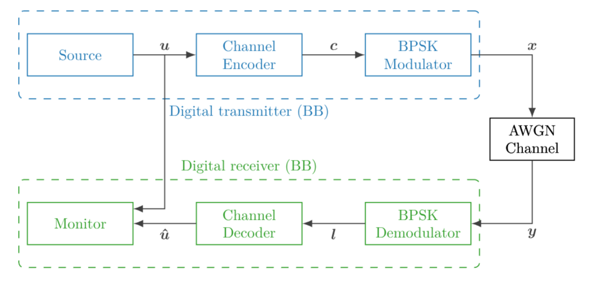
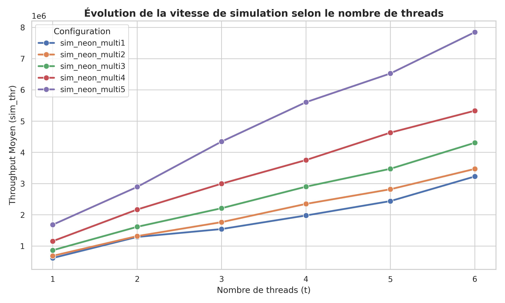
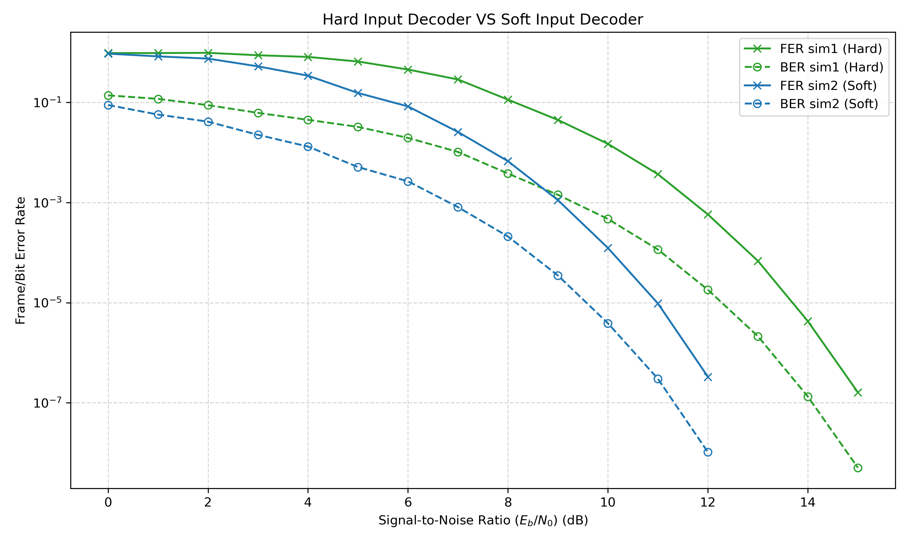

# SDR Monte-Carlo Simulation

Simulation d'une chaîne de communication numérique et étude de son optimisation
sur une NVIDIA Jetson Orin Nano.

Le projet a été réalisé dans le cadre du Master SESI à Sorbonne Université.
L'objectif était d'implémenter une chaîne de transmission simple, puis de
comparer plusieurs stratégies d'optimisation sur processeur ARM :

- version séquentielle de référence ;
- vectorisation avec Arm NEON ;
- vectorisation NEON + multithreading.

## Chaîne simulée

La chaîne utilise une modulation BPSK, un canal AWGN et un code à répétition.
Les performances sont évaluées par simulation Monte-Carlo à partir du BER et du
FER pour différentes valeurs de SNR et différents taux de codage.



La chaîne de traitement est composée des blocs suivants :

```text
Source
  |
Repetition encoder
  |
BPSK modulator
  |
AWGN channel
  |
BPSK demodulator
  |
Repetition decoder
  |
Error monitor
```

Deux types de décodage sont disponibles :

- **hard decoding** : décision binaire puis vote majoritaire ;
- **soft decoding** : combinaison des valeurs reçues avant la décision finale.

## Optimisations

### Arm NEON

Une version SIMD a été développée avec les instructions Arm NEON.

La majorité des blocs de la chaîne a été vectorisée. Les principales exceptions
sont les parties dépendant de la génération de nombres pseudo-aléatoires,
notamment la source et une partie du canal AWGN.

Les gains dépendent fortement du bloc considéré. Sur les simulations les plus
coûteuses, certains blocs atteignent environ 3x le débit de leur version
scalaire. Le canal AWGN s'est en revanche révélé plus lent dans notre
implémentation NEON et reste un point à améliorer.

### Multithreading

La simulation peut également être exécutée sur plusieurs cœurs.

Chaque thread traite indépendamment des trames complètes et les threads
partagent les compteurs d'erreurs utilisés comme condition d'arrêt de la
simulation.

Sur la Jetson Orin Nano utilisée pour les mesures, le débit augmente de manière
presque linéaire jusqu'aux 6 cœurs disponibles.



## Quelques résultats

Les simulations permettent notamment de retrouver les comportements attendus :

- le décodage soft donne de meilleurs BER/FER que le décodage hard ;
- l'augmentation de la redondance améliore la résistance au bruit ;
- le multithreading apporte un gain de débit régulier avec le nombre de cœurs ;
- l'intérêt de la vectorisation NEON dépend fortement de la nature du bloc.

> **Optionnel : mettre image ici : courbe Hard Input Decoder vs Soft Input Decoder de la page 6**


## Compilation

```bash
cmake -S . -B build
cmake --build build
```

Pour activer les statistiques de performances :

```bash
cmake -S . -B build -DENABLE_STATS=ON
cmake --build build
```

## Tests

```bash
cd build
ctest --output-on-failure
```

## Exemple

Exemple de simulation avec un code à répétition et un décodeur hard :

```bash
./simulator -m 0 -M 15 -s 1 -e 100 -K 32 -N 128 -D "rep-hard"
```

Les principaux paramètres permettent de régler :

- la plage et le pas de SNR ;
- le nombre maximal d'erreurs de trames ;
- la taille des trames ;
- le taux de répétition ;
- le type de décodage ;
- le nombre de threads ;
- l'utilisation des versions NEON.

## Scripts

Le dépôt contient également plusieurs scripts pour reproduire les campagnes de
simulation :

- `run_sim.sh` : lance les cinq configurations principales ;
- `lab4_run_sim.sh` : simulations avec sources/modulations forcées ;
- `find_f_s.sh` : exploration des paramètres de quantification ;
- `run_refs.sh` : simulations de référence.

## Auteurs

Projet réalisé par **Alexander Bakalov** et **Tifenn Fabrici**  
Master SESI — Sorbonne Université, 2025-2026
